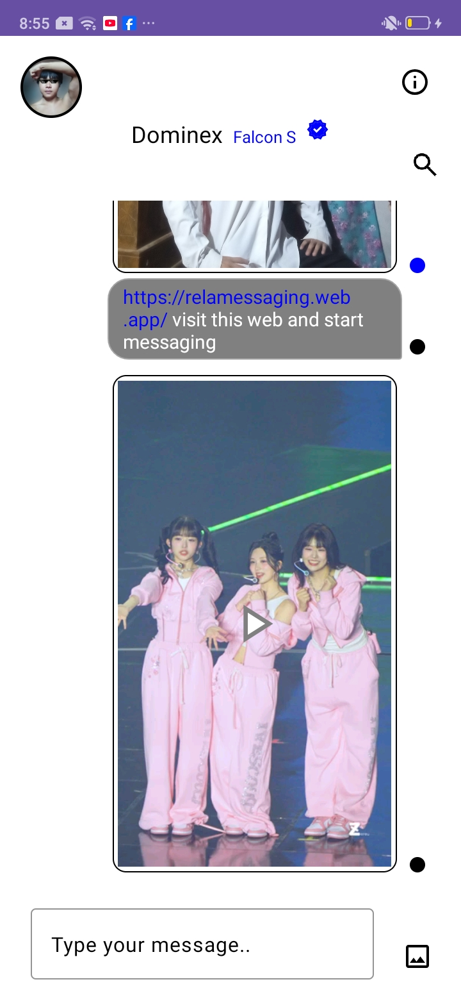
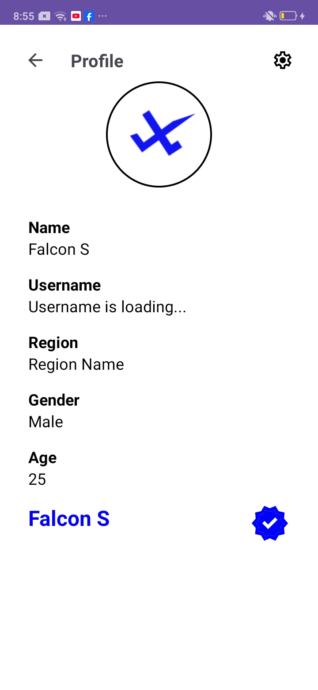
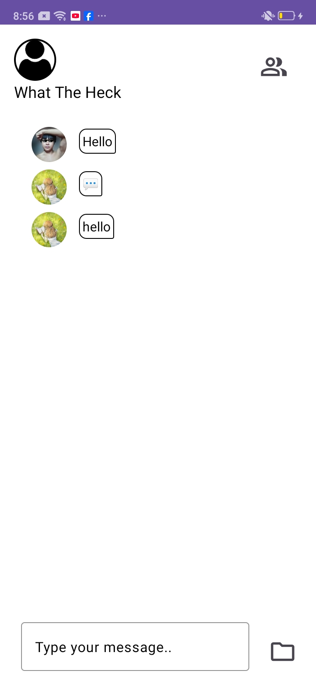
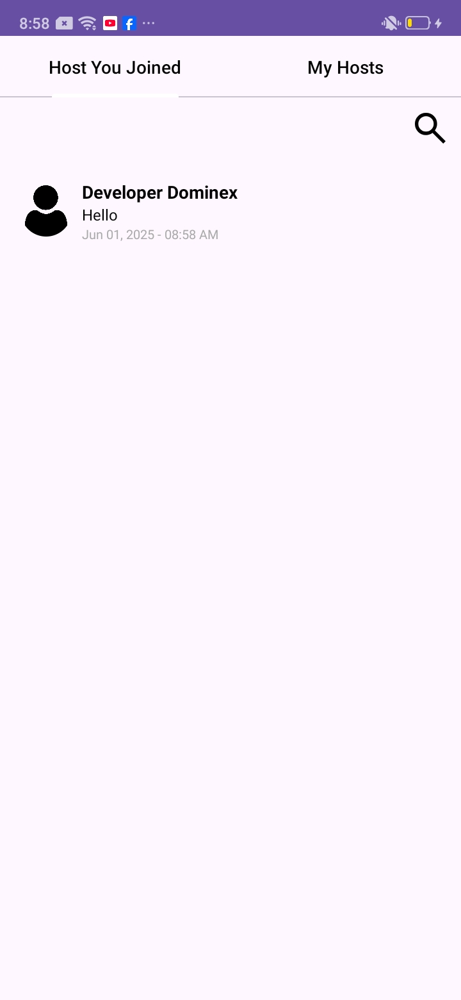

# FalconSMessagingApp
Falcon S Messaging App developed by Developer Dominex (Nexi DMXI)
# 🕊️ Falcon S Android – Secure Messaging App

**Falcon S Android** is a modern messaging app designed for fast, secure, and expressive communication. Built using Firebase, the app ensures real-time chat, intuitive navigation, multimedia support, and powerful user experience on Android devices.


---

## 🚀 Features

- 🔒 **End-to-End Secure Messaging**  
  Chat in real-time with end-to-end encryption principles.

- 💬 **One-to-One & Group Messaging**  
  Stay connected with friends and groups seamlessly.

- 🖼️ **Multimedia Support**  
  Share photos, videos, and voice messages easily.

- 🧑‍💼 **User Profiles**  
  View and manage user information with editable profile sections.

- 🧭 **Intuitive Navigation**  
  Clean, minimal design with smooth transitions and navigation drawer.

- 📡 **Firebase Integration**  
  Real-time syncing, authentication, and scalable database support.

- 🌐 **Channels ("Hosts")**  
  Create and follow public channels for updates or broadcasts.

---

## 📱 App Preview

| Chat Interface | Profile View | Group Chat | Host Channels |
|----------------|--------------|------------|----------------|
|  |  |  |  |

---

## 📥 Download

🔗 [**Download from APKPure**](https://apkpure.com/falcon-s/com.message.noblechat/download)

---

## 📸 Screenshots

More visuals and screenshots are available in the [assets/screenshots](./assets/screenshots) folder.

---

## 👤 Author

**Developer Dominex**  
📧 Contact: [falconsandroid.web.app](https://falconsandroid.web.app)

---

## 🛡️ Privacy & Data

Falcon S Android is built on Firebase and follows best practices for user data privacy. No third-party tracking or advertising SDKs are used.

---

## 🧩 Structured Data

We use [Schema.org](https://schema.org/) for SEO and enhanced search visibility. 

```json
{
  "@context": "https://schema.org",
  "@type": "SoftwareApplication",
  "name": "Falcon S Android",
  "operatingSystem": "ANDROID",
  "applicationCategory": "CommunicationApplication",
  "applicationSubCategory": "Messaging",
  "url": "https://falconsandroid.web.app/",
  "image": "https://falconsandroid.web.app/assets/logo.png",
  "description": "Falcon S Android is a fast and secure messaging app built for real-time chat, profile management, and private communication.",
  "author": {
    "@type": "Organization",
    "name": "Developer Dominex"
  }
}
